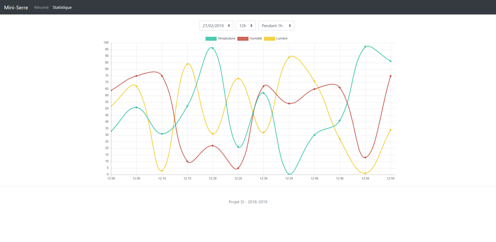

# Connected greenhouse with NodeJS/TypeScript/Arduino
A connected greenhouse containing a website for panel and communication between Arduino and TypeScript. Made in France with ❤

### This project is grouped under different folders:

#### [`website_frontend`](./website_frontend) [`website_backend`](./website_backend) 

Find the site that allows you to manage the greenhouse remotely on any 
devices

#### [`arduino`](./arduino)

Find the program of the arduino board

#### [`controller`](./controller)

Find the program that allows the connection between the site and the arduino board and managing the greenhouse

### Screenshots

#### Login page

#### Panel page

#### Chart page

