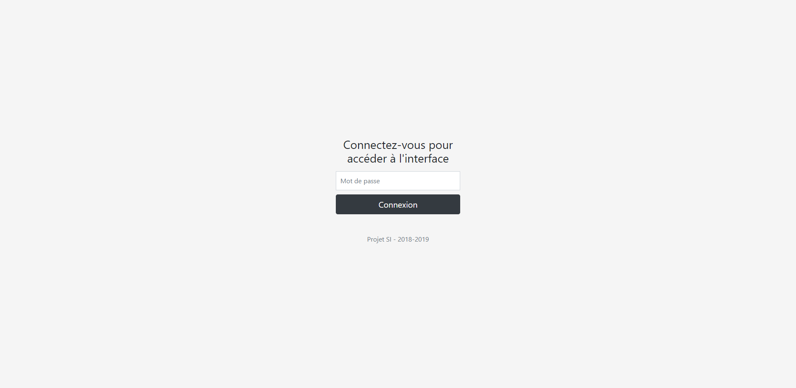

# Connected greenhouse with NodeJS/TypeScript/Arduino
A site for a connected greenhouse and communication between program and Arduino board. Made in France with ❤

### This project is grouped under different folders:

#### `website` 

Find the site that allows you to manage the greenhouse remotely on any device

#### `arduino`

Find the program of the arduino board

#### `communication`

Find the program that allows the connection between the site and the arduino board

### Screenshots

#### Login page

#### Panel page

