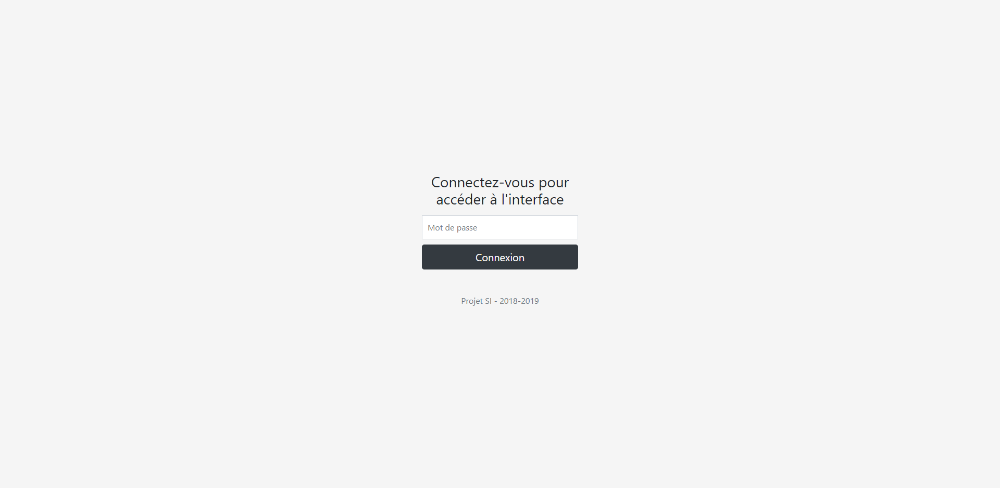
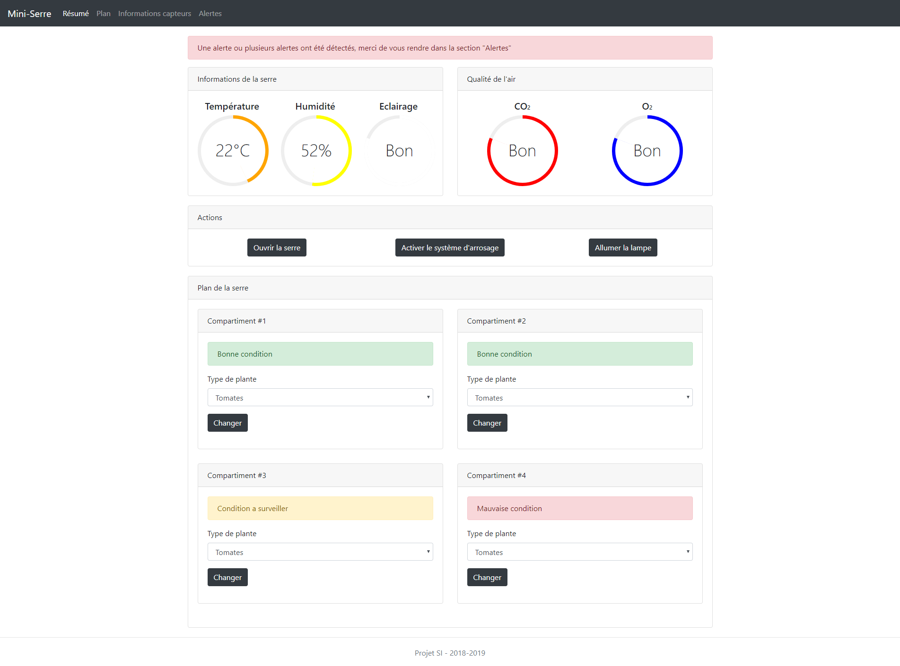

# Website Backend

## Installation

```
$ npm install
$ npm make
$ npm run
```

Make sure that `typescript` and `ts-node` are installed! (`npm install -g typescript ts-node`)

## Configuration

All of the configuration can made on `./.env`

- `DEBUG`: You can customize what you want to show on console
- `SESSION_SECRET`: Use your own session secret (Must be a 32 characters)
- `PANEL_PASSWORD`: Use your own password encrypt in SHA256

#### Default configuration

```
DEBUG = "*"

SESSION_SECRET = "nyancat"
PANEL_PASSWORD = "8c6976e5b5410415bde908bd4dee15dfb167a9c873fc4bb8a81f6f2ab448a918" (admin)
```

## URL

#### `/`

If you user is login, render the `panel` view.
Or redirect to `/login`

#### `/login`

If user is login, redirect to `/`.
Or render the `login` view.

## Screenshot

#### Login page


#### Panel page

